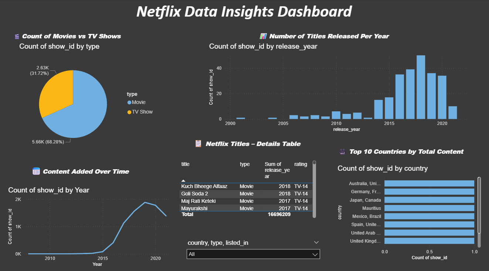

# 📊 Netflix Data Analysis Project (Power BI)

This project demonstrates an end-to-end Power BI dashboard created from Netflix's TV Shows & Movies dataset. It covers everything from data cleaning to interactive visualization.

## 🔍 Key Features:
- Title count per year
- Movies vs TV Shows breakdown
- Country-wise content release
- Rating distribution
- Interactive filtering with slicers

## 📌 Techniques Used:
1. Column Profiling
2. Null Handling & Imputation
3. Date Cleaning & Feature Engineering
4. Text Extraction & Transformation
5. Filtering irrelevant data
6. Sentiment/Text Analysis
7. Power BI visuals and slicers

## 🧰 Tools & Technologies:
- Power BI
- Power Query
- Data Cleaning
- EDA (Exploratory Data Analysis)

## 📁 Files Included:
- `netflix analysis.pbix` → Main Power BI file
- `dashboard_screenshots/` → Dashboard preview images
- `README.md` → Project description

## 📸 Dashboard Preview:

## 📅 Dataset Source:
Kaggle – [Netflix Shows Dataset](https://www.kaggle.com/datasets/shivamb/netflix-shows)

## 🙋‍♀️ Author:
Saili Dhuri  
🔗 [LinkedIn](www.linkedin.com/in/saili-dhuri) 

